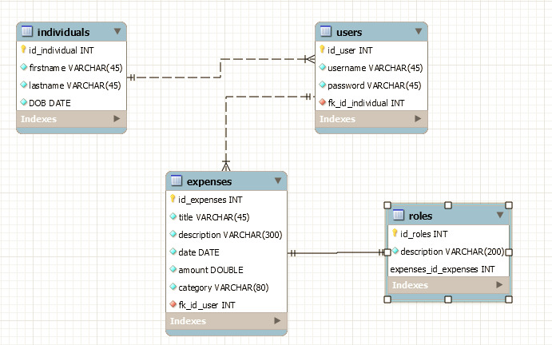
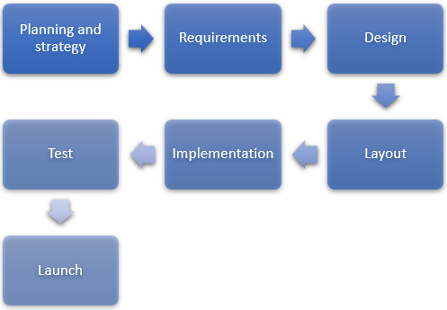

# fh-api
FH API
# Expense tracker

This is an expense tracker, enabling the functionalities of Create, Read, Update and Delete for expenses after accessing the Web app through an authorized account.

#### Contents:
- [Analysis](#analysis)
  - [Scenario](#scenario)
  - [User Stories](#user-stories)
  - [Use Case](#use-case)
- [Design](#design)
  - [Prototype Design](#prototype-design)
  - [Domain Design](#domain-design)
  - [Business Logic Design](#business-logic-design)
  - [Endpoint Design](#endpoint-design)
- [Implementation](#implementation)
  - [Backend Technology](#backend-technology)
  - [Frontend Technology](#frontend-technology)
- [Deployment](#deployment)
- [User Guide](#user-guide)
- [Project Management](#project-management)
  - [Roles](#roles)
  - [Milestones](#milestones)

## Analysis

### Scenario

The expense tracker allows companies, organizations and individuals to keep an overview of their finances. Since receipts are easy to lose and a transaction history can easily get lost, this tracker app provides an overview and the ability to add, edit, delete expenses and crypto investments. Users are also able to receive analytical data on their expenses and investments.

### User Stories
1.	UC-1 [Responsiveness] As a [user], I want to have a Web app so that I can use it on different mobile devices and on desktop computers.
2.	UC-2 [Usability] As a [user], I want to navigate through the WebApp and find all the functions in a easy way.
3.	UC-3 [Login to expense tracker]: As a [user] i can log-in after authorizing myself with a viable username and password.
4.	UC-4 [Dashboard] As a [user], I want to have a dashboard after i login.
5.	UC-5 [Register to expense tracker]: As a [non-users], I can register an account by entering my name and desired username + password.
6.	UC-6 [View Expenses] As a [user], I want to use list views so that I can explore and read my expenses.
7.	UC-7 [Add and edit expenses] As a [user], I want to be able to add, edit and delete my expenses.
8.  UC-8 [View investments] As a [user], I want to use list views so that I can explore and read my investments.
9.  UC-9 [Add and edit investments] As a [user], I want to be able to add, edit and delete my investments.
10. UC-10 [Investment prices] As a [user], I want to be able to see the actual price of my investments.
11. UC-11 [Analytics] As a [user], I want to be able to see analytics on my expenses and investments.
12. UC-12 [Profile] As a [user], I want to be able to change my name, email and password.

### Use Case


- UC-1 [Login to expense tracker]: Users can log-in after authorizing themselves with a viable username and password. 
- UC-2 [Register User]: New users have the option to register themselves with new account details to access the Web app.
- UC-3 [Edit expenses/investments]: Users can create, read, update and delete expenses and investments. 
- UC-4 [Show list of expenses/investments]: Users can get an overview of their expenses and investments as a list. The list is created in a database.

## Design

### Prototype Design

A bootstrap based static prototype has been created by using a prototyping application. 

In this case, the prototype application Bootstrap Studio has been used to create a basic user interface design based on an HTML grid, Bootstrap CSS and JavaScript, including the selection of web fonts and font-based icons.

The assets (HTML, CSS, JavaScript, image and font files) has been exported and will be extended in the later during implementation with jQuery, to build a dynamic website.

### Domain Design

The `ch.fhnw.acrm.data.domain` package contains the following domain objects / entities including getters and setters:


### Business Logic Design

The package 'https://fhnw-project.herokuapp.com/' contains the data of created persons. With this data, users are created who can store information about their spending.



### Endpoint Design
**Path**: [`/api/customer`](/api/customer) 

**Method:** `POST`

**Sample Request**  • *Header:* `Content-Type: application/json` • *Body:*

```JSON
{
  "agent": {
    "customers": [
      null
    ],
    "email": "string",
    "id": 0,
    "name": "string",
    "password": "string",
    "remember": "string"
  },
  "email": "string",
  "id": 0,
  "mobile": "string",
  "name": "string"
}
```

• *Optional:* `...`
  
**Success Response**  • *Code:* `200 OK` • *Sample Body:*

```JSON
{
  "agent": {
    "customers": [
      null
    ],
    "email": "string",
    "id": 0,
    "name": "string",
    "password": "string",
    "remember": "string"
  },
  "email": "string",
  "id": 0,
  "mobile": "string",
  "name": "string"
}
```

**Error Response** • *Code:* `404 NOT FOUND`

## Implementation

### Backend Technology
This Web application is relying on [Spring Boot](https://projects.spring.io/spring-boot) and the following dependencies:

- [Spring Boot](https://projects.spring.io/spring-boot)
- [Spring Web](https://docs.spring.io/spring/docs/current/spring-framework-reference/web.html)
- [Spring Data](https://projects.spring.io/spring-data)
- [Java Persistence API (JPA)](http://www.oracle.com/technetwork/java/javaee/tech/persistence-jsp-140049.html)
- [H2 Database Engine](https://www.h2database.com)
- [PostgreSQL](https://www.postgresql.org)

To bootstrap the application, the [Spring Initializr](https://start.spring.io/) has been used.

Then the following further dependencies has been added to the project `pom.xml`:

- Swagger and Swagger UI:
```XML
<dependency>
    <groupId>io.springfox</groupId>
    <artifactId>springfox-boot-starter</artifactId>
    <version>3.0.0</version>
</dependency>
```

- Java HTML Parser and JWT:
```XML
<dependency>
    <groupId>org.jsoup</groupId>
    <artifactId>jsoup</artifactId>
    <version>1.14.2</version>
</dependency>
<dependency>
    <groupId>io.jsonwebtoken</groupId>
    <artifactId>jjwt-api</artifactId>
    <version>0.11.2</version>
</dependency>
<dependency>
    <groupId>io.jsonwebtoken</groupId>
    <artifactId>jjwt-impl</artifactId>
    <version>0.11.2</version>
    <scope>runtime</scope>
</dependency>
<dependency>
    <groupId>io.jsonwebtoken</groupId>
    <artifactId>jjwt-gson</artifactId>
    <version>0.11.2</version>
    <scope>runtime</scope>
</dependency>
```

### Frontend Technology
This Web application is relying on the following frontend technology/libraries:

- jQuery
- Bootstrap

## Deployment
This spring boot has been deployed to Heroku by using a pre-configuration scripts `app.json` and `Procfile`.

## User Guide
The Web application can be accessed over the browser by using the following address: `https://***.herokuapp.com/`. And the Swagger-UI can be access using the specific page: `https://***.herokuapp.com/swagger-ui/`.

## Project Management

### Roles
- Head of the Project: Nico Born
- All-rounder: Marino Bottacin
- All-rounder: Laurent Zeugin
- All-rounder: Kenan Ahmetasevic

### Milestones


1.	Planning and strategy: definition of goals
2.	Requirements: Specifications, use case analysis
3.	Design: conception
4.	Layout: create website
5.	Implementation: technical implementation, implementation of business logic and API
6.	Test: testing: final acceptance
7.	Launch: Launch of Web application on Heroku

